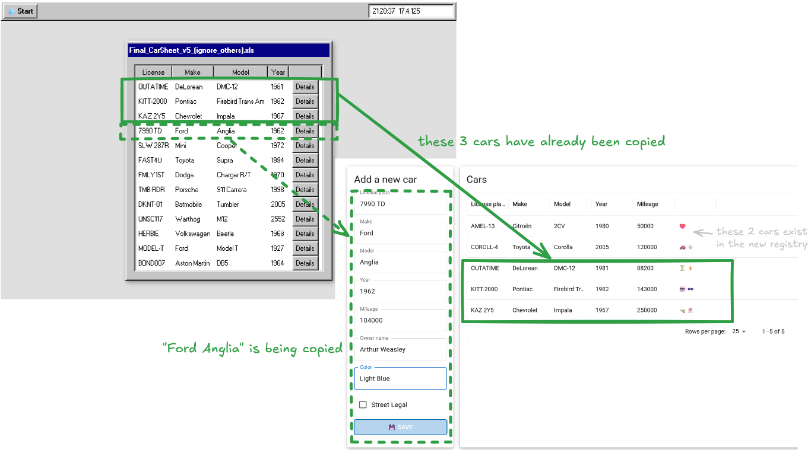

# RPA-haaste (robotic process automation)

Tässä tehtävässä sovelletaan Playwright-työkalua tietojen siirron toteuttamiseen vanhasta järjestelmästä uuteen. Siirto toteutetaan automatisoimalla vaiheet, jotka veisivät normaalilta käyttäjältä runsaasti aikaa ja jotka olisivat virhealttiita. Tällaisesta ratkaisusta käytetään usein nimitystä "ohjelmistorobotiikka" tai Robotic Process Automation (RPA). Ohjelmistorobotiikkaa tarvitaan erityisesti silloin, kun järjestelmät eivät tarjoa rajapintoja tai muuta tapaa tietojen siirtoon tai eivät muuten ole yhteensopivia.

Tehtävä tarkastetaan vaiheittain ja siitä voi saada merkittävän osan pisteistä, vaikka et saisikaan kaikkia tietoja siirrettyä.


## Tehtävän ja testauksen lähtökohdat

Tässä tehtävässä oletetaan, että olet suorittanut aikaisemmat tehtävät, joissa harjoiteltiin Playwright-projektin luontia ja asennusta sekä testien kirjoittamista ja suorittamista. Tämä tehtävärepositorio sisältää valmiiksi Playwright-projektin pohjan, jonka voit asentaa ja käynnistää seuraavasti:

```bash
npm install
npx playwright test
```

Testien suorittaminen edellyttää myös selainten asentamista, minkä olet toivottavasti tehnyt jo aikaisemmassa tehtävässä. Tarvittaessa [asenna esimerkiksi Chromium Playwrightin ohjeita seuraten](https://playwright.dev/docs/browsers).


## Tehtävä

> Subject: Help Needed: Transferring Our Fleet Data To A New System
>
> Hi,
>
> I'm the owner of AutoLegacy Oy, a small but stubbornly old-school fleet management company. Since the late 90s, we've been using a homegrown web system to keep track of all our vehicles. It's clunky, slow, insecure, and refuses to die—but it's finally time for an upgrade.
>
> We've recently signed up for a shiny new fleet management system that works in a modern browser (hallelujah!). The catch? Our old system doesn't support exporting data or integrating with anything made after the Y2K scare. There are no APIs, no CSV exports—just a painfully retro web interface where each car's data can be viewed one by one.
>
> This is where I need your help.
>
> Your task is to use Playwright to automate the transfer of our car records from the old system to the new one. You'll need to:
>
> * Visit each car entry in the old system (https://rpa-exercise-legacy-system.pages.dev/).
>
> * Extract all relevant details (e.g., registration number, model, year, mileage etc).
>
> * Fill in the corresponding fields in the new system's web form (https://rpa-exercise-target-system.pages.dev/).
>
> It's a bit like time-traveling with a clipboard, but faster—and automated. There are no room for errors, so each entry must be copied perfectly. In case of errors, the process must start over from the beginning.
>
> Let me know if you run into any trouble. I'm happy to give you access credentials, screenshots, or nostalgic war stories from the days of dial-up internet.
>
> Thanks in advance for helping us finally enter the 21st century.
>
> Best regards,<br />
> Helena Huoltokirja<br />
> Owner, AutoLegacy Oy<br />
> helena@localhost


## Käytettävät sivustot

Tehtävässä käytetään kahta erillistä verkkosivustoa, joista toinen on vanha ajoneuvorekisteri ja toinen uusi korvaava ajoneuvorekisteri. Tehtävässä sinun tulee siirtää tietoja vanhasta järjestelmästä uuteen.

Vanha järjestelmä löytyy osoitteesta https://rpa-exercise-legacy-system.pages.dev/ ja uusi järjestelmä osoitteesta https://rpa-exercise-target-system.pages.dev/.

[Vanha järjestelmä](https://rpa-exercise-legacy-system.pages.dev/) muistuttaa 90-luvun verkkosivustoa ja se on tarkoituksella toteutettu niin, että sen käyttöliittymä on hidas ja hieman epäkäytännöllinen. Järjestelmän salasana löytyy etusivulta esitäytettynä. Kirjautumisen jälkeen avautuvalla sivulla on listattuna useita autoja ja jokaisen auton tiedot on avattava erikseen. Näiden autojen tiedot tulee kopioida vanhasta järjestelmästä uuteen järjestelmään.

[Uusi järjestelmä](https://rpa-exercise-target-system.pages.dev/) on astetta nykyaikaisempi, mutta yksinkertaisuuden vuoksi pelkistetty. Sivu pitää kirjaa syötetyistä autoista ja tarkastaa automaattisesti syötettyjen tietojen oikeellisuuden verraten niitä vanhan järjestelmän tietoihin. Mikäli tiedot eivät täsmää, näytetään käyttäjälle virheilmoitus, minkä lisäksi selaimen konsoliin lokitetaan tarkemmat tiedot virheistä. Uusi järjestelmä ei tallenna syötettyjä tietoja pysyvästi, vaan tiedot nollautuvat aina sivua avattaessa tai päivitettäessä.



*__Vinkki:__ vanha järjestelmä on hidas ja sen tietoturvassa on puutteita. Voit kokeilla, josko pystyisit ohittamaan hitaan kirjautumisen ja pääsemään suoraan käsiksi autojen tietoihin. Tämä voi nopeuttaa tietojen siirtoa, mutta se ei ole pakollista. Tehtävässä on tarkoitus keskittyä automaation toteuttamiseen, ei tietoturvaan, emmekä yleisesti suosittele hyödyntämään tällaisia menetelmiä.*

## Ratkaisun toteuttaminen

Kun olet saanut projektin asennettua ja kokeillut manuaalisesti molempia sivustoja, voit toteuttaa tietojen siirron automatisoinnin. Automatisointi toteutetaan käytännössä kirjoittamalla "testi", joka käy läpi seuraavat vaiheet:

1. Avaa vanhan järjestelmän etusivu ja kirjaudu sisään.
2. Avaa vanhassa järjestelmässä jokaisen auton tiedot erikseen.
3. Kopioi kunkin auton tiedot (rekisterinumero, merkki, malli jne.) uuteen järjestelmään.
4. Tarkista, että tiedot on syötetty oikein ja että uusi järjestelmä ei ilmoita virheistä.
5. Varmista lopuksi, että uuden järjestelmän sivulle ilmestyy teksti "You have completed the exercise!".

Tämä tehtävä on luonteeltaan erilainen kuin aikaisemmat ja se voidaan ratkaista usealla eri tavalla. Voit esimerkiksi kerätä ensin kaikki vanhan järjestelmän autotietueet yhteen taulukkoon (array) ja lopuksi syöttää tiedot taulukosta uuteen järjestelmään. Vaihtoehtoisesti voit avata Playwrightin avulla useita välilehtiä tai selainikkunoita ja käyttää molempia sivustoja rinnakkain:

```ts
import { test } from '@playwright/test';

test('this test uses two tabs', async ({ page, browser, context }) => {
    await page.goto('https://tailwindcss.com/');

    const secondPage = await context.newPage();
    await secondPage.goto('https://stackoverflow.com/search?q=how+to+center+a+div');
});

test('this test uses two browser windows', async ({ page, browser, context }) => {
    await page.goto('https://git-scm.com/docs/git-merge');

    const secondPage = await browser.newPage();
    await secondPage.goto('https://stackoverflow.com/search?q=how+to+exit+vim');
});
```

Katso lisätietoja Playwrightin dokumentaatiosta sivuilta ["Pages"](https://playwright.dev/docs/pages), ["BrowserContext"](https://playwright.dev/docs/api/class-browsercontext) ja ["Browser"](https://playwright.dev/docs/api/class-browser).


## Tehtävän automaattinen arviointi

Kun olet saanut tehtävän valmiiksi tai päässyt siinä alkuun, voit palauttaa ratkaisusi automaattista tarkastusta varten. Tehtävä tarkastetaan vaiheittain ja siitä voi saada merkittävän osan pisteistä, vaikka et saisi kaikkia tietoja siirrettyä.

Lisää testisi versionhallintaan ja lähetä muutokset GitHubiin `git status`, `git add`, `git commit` ja `git push` -komennoilla. `push`-komennon jälkeen käynnistyy GitHub action -automaattitarkastus, joka suorittaa testit ja antaa niistä palautteen. Näet palautteen GitHub-repositoriosi actions-välilehdeltä.

Automaattisessa tarkastuksessa käytetään Chromium-selainta ja testit suoritetaan yksi kerrallaan headless-tilassa. Suosittelemme varmistamaan, että testit toimivat paikallisesti seuraavalla komennolla ennen palautusta:

```bash
npx playwright test --reporter="list,html" --project=chromium --trace=on
```

Tarvittaessa tutki actions-välilehden raporttia ja testituloksia. Myös selaimen konsoliin tulostuneiden virheilmoitusten tutkimisesta on apua mahdollisten pienten muotoseikkojen korjaamisessa. Voit palauttaa tehtävän uudelleen useita kertoa tehtävän määräaikaan asti.


## Materiaalista

Tämän tehtävän on kehittänyt Teemu Havulinna ja se on lisensoitu [Creative Commons BY-NC-SA -lisenssillä](https://creativecommons.org/licenses/by-nc-sa/4.0/).

Tehtävän luonnissa on hyödynnetty kielimalleja ja tekoälytyökaluja, kuten GitHub Copilot ja ChatGPT.
